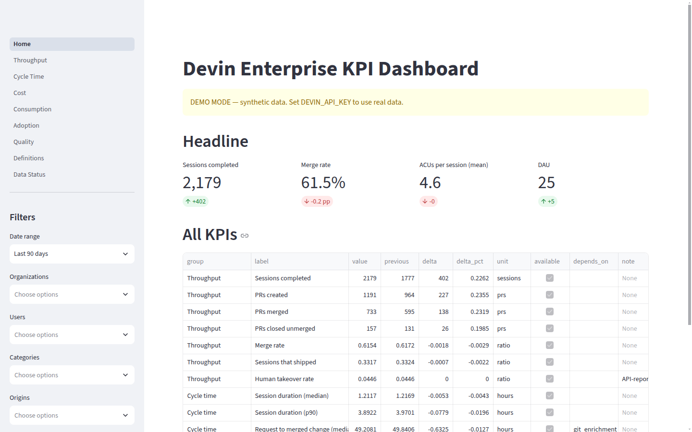
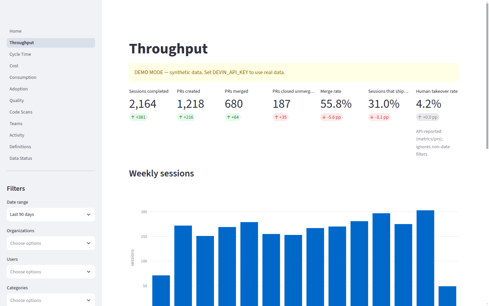
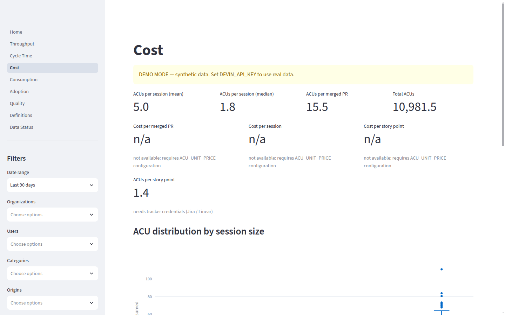
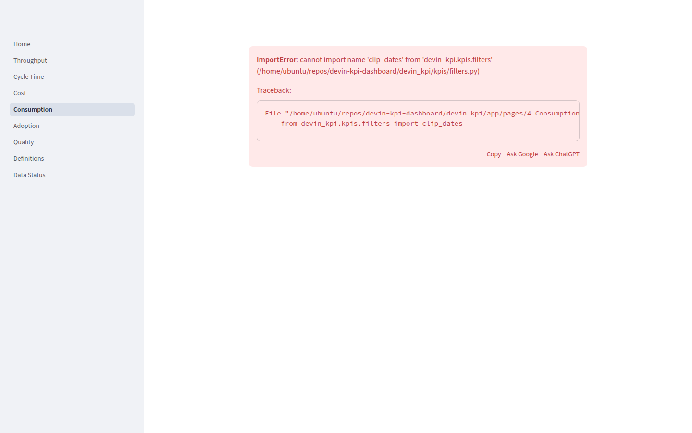
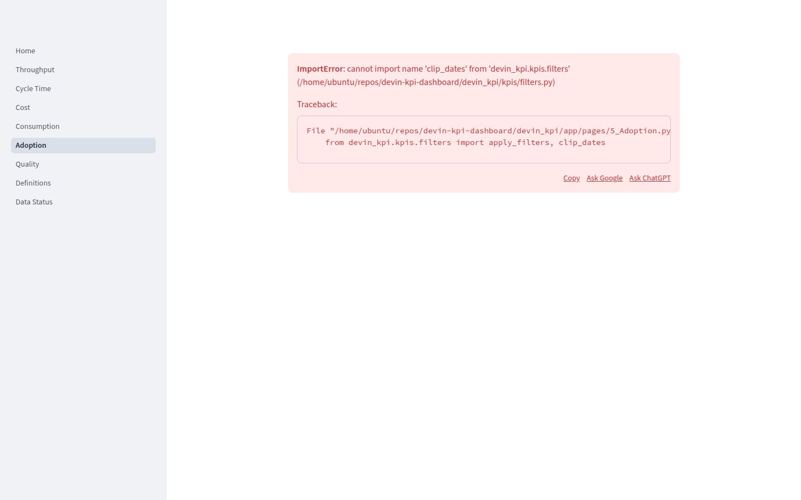
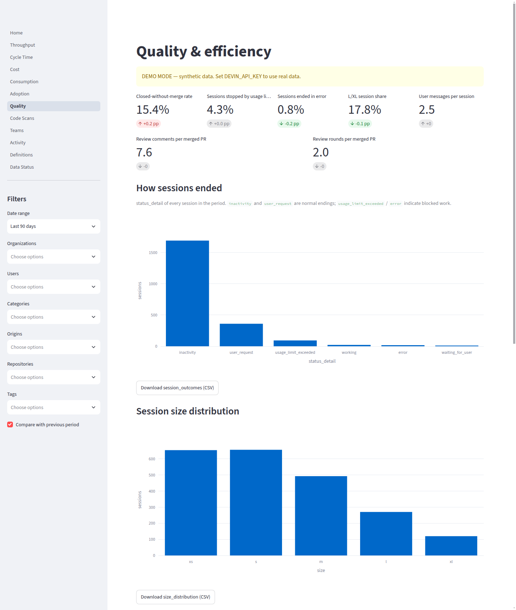
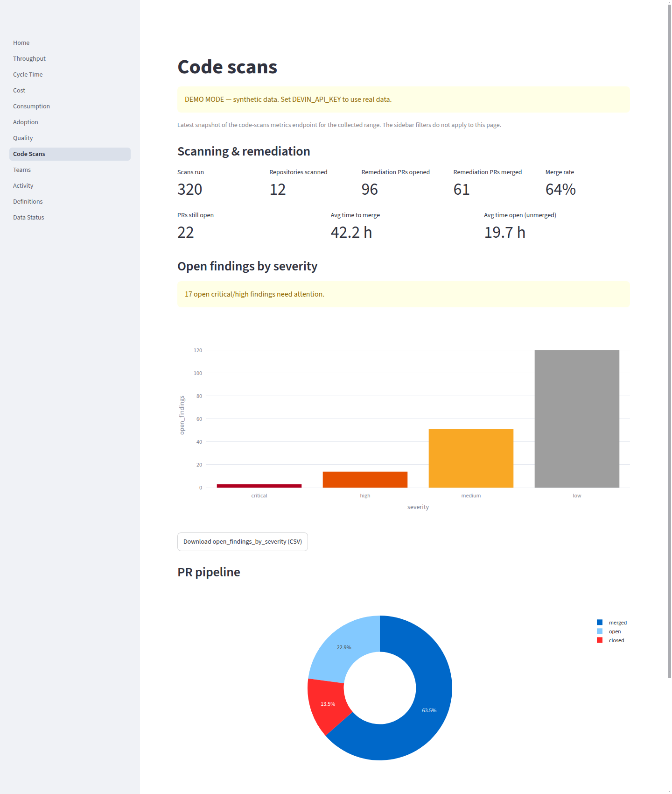
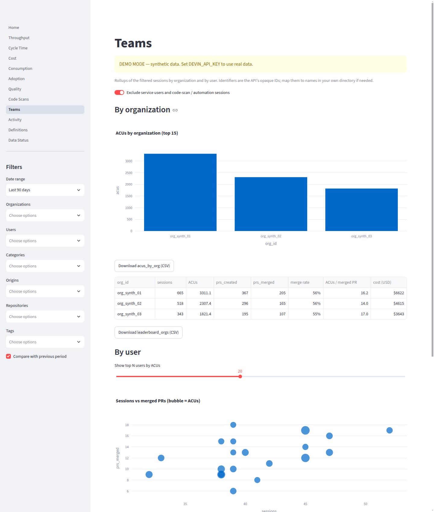
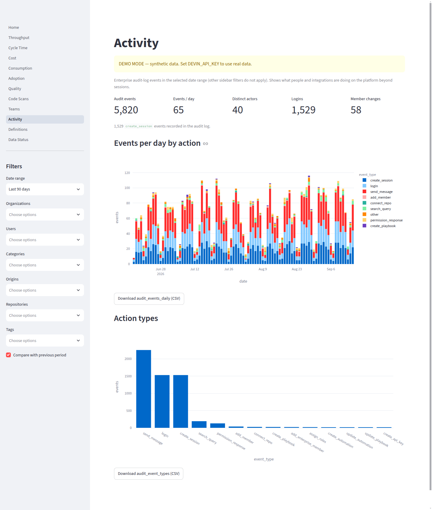

# Devin KPI Dashboard

An open-source, self-hostable reporting dashboard that turns the raw data
exposed by the **Devin Enterprise API** into KPIs an engineering executive
actually asks about: how much shipped (merged PRs), what each delivered
unit cost in ACUs and dollars, whether adoption is growing among real
engineers, and where sessions are failing or hitting limits. The Overview
page is a one-screen executive summary with plain-English takeaways and
period-over-period deltas; the sub-pages carry the diagnostics.

The app is **read-only**: it authenticates with a Devin service-user API
key or PAT (`cog_…`) as a bearer token, works with a read-only role, and
never calls any endpoint that creates, updates, or deletes. No telemetry;
the only outbound calls are to `api.devin.ai` and — optionally — your git
provider / issue tracker for enrichment.

No API key? The app runs in **demo mode** against a bundled synthetic
dataset so you can try every page without touching real data.

## Quick start (< 15 minutes)

### With a real API key

```bash
python3 -m venv .venv && .venv/bin/pip install -e ".[dev]"
cp .env.example .env          # set DEVIN_API_KEY (and DEVIN_ORG_ID if org-scoped)
make collect                  # pull ~90 days of data into data/devin_kpi.sqlite
make run                      # streamlit on http://localhost:8501
```

### Demo mode (no key)

```bash
python3 -m venv .venv && .venv/bin/pip install -e ".[dev]"
make demo && make run
```

### Docker

```bash
docker compose up --build     # http://localhost:8501
```

`docker-entrypoint.sh` generates the synthetic dataset automatically when
`DEVIN_API_KEY` is unset; mount `./data` to persist it.

## How it works

1. **Collector** (`python -m devin_kpi collect`) pulls every read endpoint
   into a local SQLite file — sessions + insights in daily windows,
   per-day metrics snapshots (usage, sessions, prs, sessions-by-category),
   whole-range dau/wau/mau, consumption/daily snapped to **midnight
   Pacific**, consumption cycles, code-scan metrics, and audit logs.
   `collector_runs` makes it resumable and idempotent; windows younger
   than `--refresh-days` (default 7) are re-pulled so late status/ACU
   updates land.
2. **Enrichment** (`python -m devin_kpi enrich`) is optional: PR lifecycle
   fields from GitHub/GitLab/Azure DevOps, story points from Jira/Linear.
   Charts that need enrichment degrade gracefully and say so.
3. **Dashboard** (`make run`) computes every KPI from the fact tables via
   pure pandas functions — all filterable by date, org, user, category,
   origin, repo, and tag (the last two only appear when the data has
   values), with previous-period comparison. API-reported metric
   snapshots are shown alongside for cross-checking.

### Pages

| Page | Audience question | Needs |
|---|---|---|
| **Overview** | Are we shipping, what does it cost, who is adopting, what needs attention? Plain-English summary + headline cards + weekly trend. | API only |
| Throughput | Completed sessions, PRs created / merged / closed, merge rate, takeover rate. | API only |
| Cycle time | Session duration; request-to-merge and PR open-to-merge once a git token is set. | API (+ git) |
| Cost | Spend and ACUs per session / merged PR / story point, by size and category. | API (+ `ACU_UNIT_PRICE`, tracker) |
| Consumption | Daily ACUs by product, billing cycles. | API only |
| Adoption | Human DAU/WAU/MAU (service accounts and code-scan/automation sessions excluded), computed vs API-reported, playbook share, seat utilisation. | API (+ `SEAT_COUNT`) |
| Quality | How sessions end (`status_detail`), usage-limit and error rates, session size, user messages, recurring issue types. | API only |
| Code scans | Scans run, repos covered, remediation PR pipeline, open findings by severity. | API only |
| Teams | Per-organization and per-user rollups (opaque IDs only): sessions, ACUs, merged PRs, merge rate, ACUs per merged PR. | API only |
| Activity | Audit-log events per day by action type, logins, member changes. No actor emails. | API only (enterprise scope) |
| Definitions / Data status | Formula for every KPI; freshness, row counts, enrichment status. | — |

KPIs that depend on optional setup (git token, tracker credentials,
`ACU_UNIT_PRICE`, `SEAT_COUNT`) are hidden from the main layout until that
setup exists and listed once in a collapsed "needs setup" section, so an
unconfigured install never shows a wall of `n/a` cards.

### Scope detection

The key's scope is auto-detected: `GET /v3/enterprise/metrics/usage` is
probed; on 401/403/404 the client falls back to
`/v3/organizations/{DEVIN_ORG_ID}/...` when `DEVIN_ORG_ID` is set.
Endpoints with no org equivalent (cycles, audit-logs) are skipped.

## Configuration reference

| Variable | Required | Default | Purpose |
| --- | --- | --- | --- |
| `DEVIN_API_KEY` | real mode | — | Devin service-user key / PAT (`cog_…`). Unset → demo mode. |
| `DEVIN_API_BASE_URL` | no | `https://api.devin.ai` | API base URL |
| `DEVIN_ORG_ID` | org-scoped keys | — | Organization ID for org-scoped keys |
| `ACU_UNIT_PRICE` | no | — | USD per ACU; enables dollar KPIs (demo mode assumes $2.00/ACU) |
| `GITHUB_TOKEN` | no | — | GitHub PR enrichment (cycle time, review load, diff size) |
| `GITLAB_TOKEN` | no | — | GitLab MR enrichment |
| `AZURE_DEVOPS_PAT` | no | — | Azure DevOps PR enrichment |
| `JIRA_BASE_URL` | no | — | e.g. `https://you.atlassian.net` |
| `JIRA_EMAIL` | no | — | Jira account email |
| `JIRA_API_TOKEN` | no | — | Jira API token |
| `JIRA_STORY_POINTS_FIELD` | no | `customfield_10016` | Jira custom field id for story points |
| `LINEAR_API_KEY` | no | — | Linear API key (uses issue `estimate`) |
| `ISSUE_KEY_REGEX` | no | `[A-Z][A-Z0-9]+-\d+` | Regex extracting issue keys from titles/tags/PR titles |
| `SEAT_COUNT` | no | — | Licensed seats, for active-vs-licensed KPI |
| `DATABASE_PATH` | no | `data/devin_kpi.sqlite` | Real-data SQLite path |
| `DEMO_DATABASE_PATH` | no | `data/demo.sqlite` | Synthetic dataset path |
| `CONSUMPTION_DAY_TZ` | no | `America/Los_Angeles` | Day-boundary timezone for consumption |

## Optional enrichment

- **Git providers**: set `GITHUB_TOKEN` (or `GITLAB_TOKEN`,
  `AZURE_DEVOPS_PAT`) and run `python -m devin_kpi enrich`. Enables
  request→merge and open→merge cycle times, review comments/rounds, diff
  size. Without it those charts fall back to session duration and are
  labeled.
- **Issue trackers**: set `JIRA_*` or `LINEAR_API_KEY` and run
  `enrich`. Sessions linked to issues (via `jira`/`linear` origin or keys
  matched by `ISSUE_KEY_REGEX` in titles/tags) get story points → cost
  per story point. Without it the story-point KPIs are hidden and the app
  shows cost per merged PR/session instead.
- **ACU price**: set `ACU_UNIT_PRICE` to unlock dollar figures; otherwise
  the dashboard shows ACUs only.

## KPI definitions

Every displayed number can be traced to a formula below (also shown in
the app's Definitions page) and reproduced from the exported CSV.
Regenerate this section with `python scripts/gen_definitions_md.py`.

<!-- KPI_DEFINITIONS_START -->
## Throughput

| KPI | Formula | Source | Depends on |
| --- | --- | --- | --- |
| Sessions completed (`sessions_completed`) | Count of sessions with a terminal status in period (status is exit or suspended — anything not running) | sessions list | — |
| PRs created (`prs_created`) | Count of session PRs whose session was created in period | sessions pull_requests[] | — |
| PRs merged (`prs_merged`) | PRs created with pr_state merged | sessions pull_requests[] | — |
| PRs closed unmerged (`prs_closed_unmerged`) | PRs created with pr_state closed but not merged | sessions pull_requests[] | — |
| Merge rate (`merge_rate`) | prs_merged / prs_created | sessions pull_requests[] | — |
| Sessions that shipped (`sessions_shipped_rate`) | sessions with >=1 merged PR / sessions created | sessions + pull_requests[] | — |
| Human takeover rate (`human_takeover_rate`) | prs_taken_over_count / prs_created_count | metrics/prs snapshot | — |

## Cycle time

| KPI | Formula | Source | Depends on |
| --- | --- | --- | --- |
| Request to merged change (median) (`request_to_merge_median`) | median(merged_at - session.created_at) over merged PRs | session_prs (git enrichment) | git_enrichment |
| Request to merged change (p90) (`request_to_merge_p90`) | p90(merged_at - session.created_at) over merged PRs | session_prs (git enrichment) | git_enrichment |
| Session duration (median) (`session_duration_median`) | median(updated_at - created_at) over terminal sessions | sessions list | — |
| Session duration (p90) (`session_duration_p90`) | p90(updated_at - created_at) over terminal sessions | sessions list | — |
| PR open to merge (median) (`pr_open_to_merge_median`) | median(merged_at - pr_created_at) over merged PRs | session_prs (git enrichment) | git_enrichment |
| PR open to merge (p90) (`pr_open_to_merge_p90`) | p90(merged_at - pr_created_at) over merged PRs | session_prs (git enrichment) | git_enrichment |

## Cost

| KPI | Formula | Source | Depends on |
| --- | --- | --- | --- |
| ACUs per session (mean) (`acus_per_session_mean`) | mean(acus_consumed) | sessions list | — |
| ACUs per session (median) (`acus_per_session_median`) | median(acus_consumed) | sessions list | — |
| ACUs per merged PR (`acus_per_merged_pr`) | sum(acus_consumed) / merged PR count | sessions + pull_requests[] | — |
| Cost per merged PR (`cost_per_merged_pr`) | acus_per_merged_pr * ACU_UNIT_PRICE | config | ACU_UNIT_PRICE |
| Cost per session (`cost_per_session`) | acus_per_session_mean * ACU_UNIT_PRICE | config | ACU_UNIT_PRICE |
| Cost per story point (`cost_per_story_point`) | sum(acus of sessions w/ pointed issues) / sum(story_points) * ACU_UNIT_PRICE | session_issues (tracker enrichment) | tracker_enrichment, ACU_UNIT_PRICE |
| ACUs per story point (`acus_per_story_point`) | sum(acus of sessions w/ pointed issues) / sum(story_points) | session_issues (tracker enrichment) | tracker_enrichment |
| Total ACUs (`total_acus`) | sum(acus_consumed) | sessions list | — |
| Total spend (`total_cost`) | total_acus * ACU_UNIT_PRICE | sessions + config | ACU_UNIT_PRICE |

## Adoption

| KPI | Formula | Source | Depends on |
| --- | --- | --- | --- |
| DAU (`dau`) | distinct human users with >=1 session on the period's last day (excludes service users and code_scan/automation origins) | sessions list | — |
| WAU (`wau`) | distinct human users with >=1 session in the 7 days ending at the period end (trailing window; not clipped by the period start) | sessions list | — |
| MAU (`mau`) | distinct human users with >=1 session in the 30 days ending at the period end (trailing window; not clipped by the period start) | sessions list | — |
| Stickiness (DAU/MAU) (`stickiness`) | DAU / MAU | sessions list | — |
| Active users vs licensed (`active_vs_licensed`) | distinct human users active in period / SEAT_COUNT | sessions + config SEAT_COUNT | SEAT_COUNT |
| Playbook & automation share (`playbook_automation_share`) | sessions with playbook_id or automation_id / all sessions | sessions list | — |

## Quality & efficiency

| KPI | Formula | Source | Depends on |
| --- | --- | --- | --- |
| L/XL session share (`large_session_share`) | sessions with size L or XL / sized sessions | session_insights.session_size | — |
| User messages per session (`user_messages_per_session`) | mean(num_user_messages) | session_insights | — |
| Closed-without-merge rate (`closed_without_merge_rate`) | prs_closed_unmerged / prs_created | sessions pull_requests[] | — |
| Review comments per merged PR (`review_comments_per_merged_pr`) | mean(review_comments) over merged PRs | session_prs (git enrichment) | git_enrichment |
| Review rounds per merged PR (`review_rounds_per_merged_pr`) | mean(review_rounds) over merged PRs | session_prs (git enrichment) | git_enrichment |
| Sessions stopped by usage limit (`usage_limit_hit_rate`) | sessions with status_detail in (usage_limit_exceeded, org_usage_limit_exceeded, user_usage_limit_exceeded) / sessions created | sessions list (status_detail) | — |
| Sessions ended in error (`session_error_rate`) | sessions with status_detail error / sessions created | sessions list (status_detail) | — |
<!-- KPI_DEFINITIONS_END -->

## CSV export

Every chart has a download button for its exact underlying data, and the
Overview page exports the whole KPI table (current vs previous period) —
built for pasting into someone else's slide deck. CLI equivalent:
`python -m devin_kpi export-kpis --start 90d --out kpis.csv`.

## Demo

Short walkthrough of the dashboard in demo mode (synthetic data only):


[MP4 version](docs/demo/synthetic-demo.mp4)

## Screenshots

All screenshots and the demo video are taken against the bundled synthetic
dataset.











## Privacy

The repository contains **no real account data** — only the synthetic
generator. SQLite files under `data/` are git-ignored; never commit real
session data, org/user identifiers, API responses, or screenshots of real
accounts.
